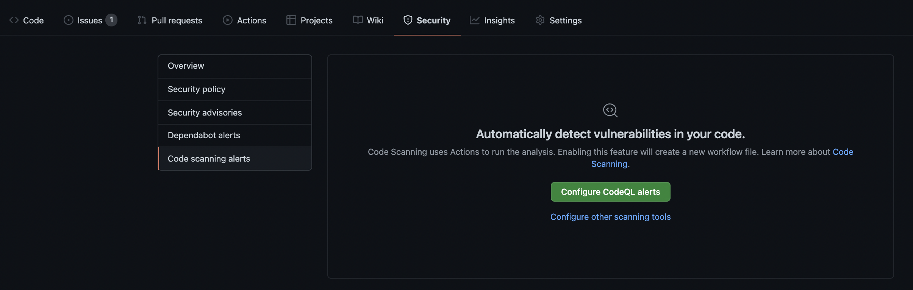
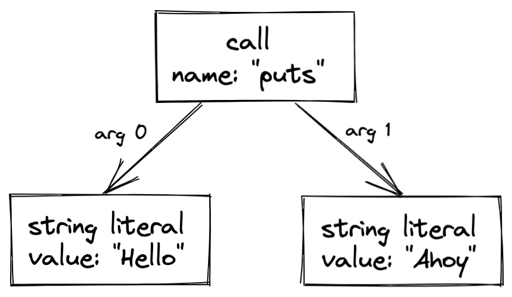

# Making Sense of Code Scanning with CodeQL

It's no secret that GitHub's code scanning tool, CodeQL, can help organizations of any size develop software faster and more securely, all without needing to leave GitHub.com, and there's no shortage of awesome content explaining what this looks like from the developer or organization owner's perspectives using the tool. However, something that I've struggled with is figuring out a simple yet thorough explanation of the mechanisms behind _how_ CodeQL delivers its code scanning alerts (something even deeper than statements like "it queries a relational database representation of the repo's code, which gets generated with every trigger event"). So that's why I'm writing this, and if it's something you'd like to learn, Keep Reading.

One final note: my focus here is on _how_ CodeQL works, not why it's valuable. To better understand the value propisition of using code scanning to help SHIFT LEFT, then you can read more about it [here](https://github.blog/2020-08-27-secure-at-every-step-putting-devsecops-into-practice-with-code-scanning/).

### The Basic Steps of CodeQL
1. Preparing the code by creating a CodeQL database
2. Running CodeQL queries against the database
3. Interpreting/presenting the query results

For my deep-dive here, I'm going to tackle each one of these in turn, starting with the first. Remember that in the context of code scanning with CodeQL, the running of this  process is defined in the workflow YAML file inside your .github/workflows directory in your repo. The setup to get started with this has been automated on GitHub and occurs when you first turn on code scanning under the "Security" tab of your repo. See here:



Clicking on the "Configure CodeQL alerts" button will create a YAML file in your workflow directory that looks something like [this](https://github.com/nomdal/continuous-integration-circle/blob/nomdal-patch-1/.github/workflows/codeql-analysis.yml). It is fully customizable, but starts off with some defaults, like executing the scan whenever there's a pull request or push against the main branch of the repo, as well as on a scheduled timetable. Bear in mind, however, that this is only the automation to execute the code scanning, and that the process itself can also be executed manually from the CLI on a repo if you have the right packages included (read more about how to do so [here](https://codeql.github.com/docs/codeql-cli/getting-started-with-the-codeql-cli/)).

But regardless of how its setup and triggered, lets figure out how the code scanning process actually works:

## 1. Preparing the Code by Creating a CodeQL Database

The most basic explanation you'll find regarding this step is that to create a database, CodeQL first extracts a single relational representation of each source file in the codebase. But what does that entail?

### The Extraction Process

The conversion from source code to a queryable database is done by a special program called an extractor, and to perform this process on any given language, an extractor built specifically for that language is needed. As I'll explain later, the ambiguities present in certain programming languages (such as Ruby) make it harder to write extractors, as one of the key functions of an extractor is to _parse_ the code, which is more difficult for more ambiguous languages.

Beyond which language is being used, there are two different scenarios for the extraction process, both covered below:

#### Extraction for Compiled Languages

Extraction in this case works by monitoring the normal build process. Each time a compiler is invoked to process a source file, a copy of that file is made, and all relevant information about the source code is collected. This includes syntactic data about the abstract syntax tree and semantic data about name binding and type information, which we'll cover in greater detail shortly.

#### Extraction for Non-Compiled Languages

For non-compiled languages, the extractor runs directly on the source code, resolving dependencies to give an accurate representation of the codebase.

In both scenarios, a parse tree is ultimately created to represent the source code, and this tree is then transformed into a relational database to run queries against. What exactly does that mean, though? Let's use an example from the [GitHub Blog](https://github.blog/2022-02-01-code-scanning-and-ruby-turning-source-code-into-a-queryable-database/).

Whatever program we're looking at, there must be some function that kicks the whole thing off, and it's at this location that our parse tree takes root. Let's use this basic Ruby function as a hypothetical starting point:

```puts("Hello", "Ahoy")```

The program contains three expressions: the string literals ```"Hello"``` and ```"Ahoy"``` and a call to a method named ```puts```, which prints its inputs to new lines. A minimal parse tree for the program like this:



Remember, it's the role of our extractor to follow along with our code to build a representation of this parse tree. Compilers and static analysis tools like CodeQL often convert the parse tree into a simpler format known as an abstract syntax tree (AST), so-called because it abstracts away some of the syntactic details that do not affect the meaning of the program, such as comments, whitespace, and parentheses. However, for CodeQL the Ruby extractor stores the parse tree in the database, since those syntactic details can sometimes be useful. We then provide a query library to transform this into an AST, and most of our queries and query libraries build on top of that transformed AST, either directly or after applying further transformations (such as the construction of a data-flow graph).

While the above example is quite simple, you can imagine how if other functions were ultimately called by the root of the tree, they would then generate their own branches beneath them, and we'd follow it to the bottom until the entire codebase has been parsed into a single tree. It is at this point that we need to convert this parse tree object into a relational database for us to query, the main job of the extractor.

Going back to the diagram above, I can attempt to convert it to relational form. To do that, I must first define a schema for the database, which is a bit more art than science.

```
expressions(id: int, kind: int)
calls(expr_id: int, name: string)
call_arguments(call_id: int, arg_id: int, arg_index: int)
string_literals(expr_id: int, val: string)
```

The _expressions_ table has a row for each expression in the program. Each one is given a unique _id_, a primary key that can be used to reference the expression from other tables. The _kind_ column defines what kind of expression it is. Let's define it so a value of 1 means the expression is a method call and 2 means it’s a string literal, and so on.

The _calls_ table has a row for each method call, and it allows us to specify data that is specific to call expressions. The first column, _expr_id_ is a foreign key, i.e. the id of the corresponding entry in the _expressions_ table, while the second column specifies the _name_ of the method. You might have expected that we'd add columns for the call’s arguments, but calls can take any number of arguments, so we wouldn’t know how many columns to add, so instead, we put them in a separate _call_arguments_ table.

The _call_arguments_ table, therefore, has one row per argument in the program. It has three columns: 1) _call_id_, which is a reference to the call expression, 2) _arg_id_, which is a reference to an argument, and 3) _arg_index_ that specifies the index, or number, of that argument.

Finally, the _string_literals_ table lets us associate the literal text value (_val_) with the corresponding entry (_expr_id_) in the _expressions_ table.

So now that we've defined our schema, let's manually populate a matching database with rows for our simple program:

EXPRESSIONS

| id    |   kind            |
| ----- | -----             |
| 100   | 1 (call)          |
| 101   | 2 (string literal)|
| 102   | 2 (string literal |

CALLS

|expr_id| name  |
| ----- | ----- |
| 100   | "puts"|

CALL_ARGUMENTS

| call_id	  |   arg_id  | arg_index |
| ------    | ------    | ------    |
| 100       | 101       |  0        |
| 100       | 102       |  1.       |

STRING_LITERALS

| expr_id	 |   val	     | 
| -----    | ----------- | 
| 101      | "Hello"     | 
| 102      | "Ahoy"      |

Every language has unique quirks, so each one CodeQL supports has its own schema, perfectly tuned to match that language’s syntax. Whereas our example schema has only two kinds of expression (calls and string literals), the [JavaScript](https://github.com/github/codeql/blob/d00196f6be5282ca4fa02dadb74a8c9675d96eec/javascript/ql/lib/semmlecode.javascript.dbscheme) and [Ruby](https://github.com/github/codeql/blob/d00196f6be5282ca4fa02dadb74a8c9675d96eec/ruby/ql/lib/ruby.dbscheme) schemas that GitHub defines for CodeQL, for example, both define over 100 kinds of expression. Those schemas were written manually, refined and expanded over the years as we make improvements and add support for new language features.

How easy or difficult this translation from parse tree to relational database is depends a lot on how similar those two structures look. For some languages, we defined our database schema to closely match the structure (and naming scheme) of the tree produced by the parser. That is, there’s a high level of correspondence between the parser’s node names and the database’s table names. For those languages, an extractor’s job is fairly simple. For other languages, where we perhaps decided that the tree produced by the parser didn’t map nicely to our ideal database schema, we have to do more work to convert from one to the other.

After extraction, all the data required for analysis (relational data, copied source files, and a language-specific database schema, which specifies the mutual relations in the data) is imported into a single directory, known as a CodeQL database. At this point, we've created a relational database representation of our code, and thus, are done with Step 1 and can move on to Step 2.

## 2. Running QL queries against the CodeQL database

Now, suppose the above example was a SQL database, and we wanted to write a query to find all the expressions that are arguments in calls to the puts method. It might look like this:

```
SELECT call_arguments.arg_id
FROM call_arguments
INNER JOIN calls ON calls.expr_id = call_arguments.call_id
WHERE calls.name = "puts";
```

In practice, however, we don’t use SQL. Instead, CodeQL queries are written in the QL language and evaluated using our custom database engine. QL is an object-oriented, declarative logic-programming language that is superficially similar to SQL but based on [Datalog](https://en.wikipedia.org/wiki/Datalog). Here’s what the same query might look like in QL:

```
from MethodCall call, Expr arg
where
  call.getMethodName() = "puts" and
  arg = call.getAnArgument()
select arg
```

```MethodCall``` and ```Expr``` are classes that wrap the database tables, providing a high-level, object-oriented interface, with helpful predicates like ```getMethodName()``` and ```getAnArgument()```.

You can read more about writing queries for Ruby in CodeQL [here](https://codeql.github.com/docs/codeql-language-guides/basic-query-for-ruby-code/), or running them on the CodeQL CLI [here](https://codeql.github.com/docs/codeql-cli/using-custom-queries-with-the-codeql-cli/).

#### But what queries will return potential vulnerabilities in our code?

Whether we're talking about CodeQL or some other vendor's solution, this is the question at the heart of code scanning. In addition to custom queries that you can write yourself to find vulnerabilities, there are different packs of pre-written queries created by the GitHub Security Lab that you can run. When you follow the setup for the CodeQL automated workflow (discussed at the start of this post), default querues are used for whatever languages it detects you’re using, and these defaults are specifically chosen for their hit rate on high severity alerts.

Though it might be a little out of date depending on when you're reading this, you can find the default queries by looking at this repo:
https://github.com/advanced-security/codeql-queries/ and going in the directory for whatever language you want to see. Check out the corresponding README for more information. It lists how many queries are under the different packs/suites, and you can find the specific queries called for each in the json file ```queries.json```, which references them in the main CodeQL repo, here: https://github.com/github/codeql (again, look under the corresponding language directories).

The majority of the queries in these main packs/suites are built to check for major CWEs ([Common Weakness Enumeration](https://en.wikipedia.org/wiki/Common_Weakness_Enumeration)), which is a categorization system for software weaknesses and vulnerabilities maintained by the National Cybersecurity FFRDC (which is federally funded part of the Mitre Corporation). The NFC ranks the CWEs (which have numbers to identity them, such as CWE-787, for an out of bounds write) by severity, and the default CodeQL queries largely correspond to the most dangerous known software weaknesses.

#### Here's an example of how CodeQL checks for a known vulnerability, **CWE-079**

[CWE-079](https://cwe.mitre.org/data/definitions/79.html) is #2 on CWE's [Top 25 Most Dangerous Software Weaknesses for 2021](https://cwe.mitre.org/top25/archive/2021/2021_cwe_top25.html). It represents a **cross-site scripting vulnerability** (also known as **XSS**), meaning that the code doesn't properly neutralize inputs during web page generation. As you can see on the vulnerability's [entry](https://cwe.mitre.org/data/definitions/79.html) on the cwe.mitre.org website, there are three main types of XSS:

1. Reflected XSS (or Non-Persistent)
2. Stored XSS (or Persistent)
3. DOM-Based XSS

If you look at the [default CodeQL queries for Ruby](https://github.com/advanced-security/codeql-queries/blob/main/ruby/queries.json), you'll see both **1.** and **2.** are checked for (**#3** is really only a js vulnerability, so you won't find it in the Ruby default queries, though you will in the js ones). You can then find these actual queries in the https://github.com/github/codeq1 repo, [here](https://github.com/github/codeql/tree/main/ruby/ql/src/queries/security/cwe-079).

Notice that each query has two corresponding files: 

1. ql query file, representing the actual executable query
2. qhelp file, which contains detailed information about the purpose and use of that query

NOTE: there are also .qll files, which represent query libraries, are are found higher up in the directory

For this example, let's look at the ```StoredXSS.ql``` file, which is our query written in QL to run against the CodeQL database we generated in Step 1 and check for this particular vulnerability.

```
/**
 * @name Stored cross-site scripting
 * @description Using uncontrolled stored values in HTML allows for
 *              a stored cross-site scripting vulnerability.
 * @kind path-problem
 * @problem.severity error
 * @security-severity 6.1
 * @precision high
 * @id rb/stored-xss
 * @tags security
 *       external/cwe/cwe-079
 *       external/cwe/cwe-116
 */
 
import ruby
import codeql.ruby.security.StoredXSSQuery
import codeql.ruby.DataFlow
import DataFlow::PathGraph

from StoredXSS::Configuration config, DataFlow::PathNode source, DataFlow::PathNode sink
where config.hasFlowPath(source, sink)
select sink.getNode(), source, sink, "Cross-site scripting vulnerability due to $@",
  source.getNode(), "stored value"
```

#### What's happening:
The main work of this query is done by the taint tracking library (import codeql.ruby.security.StoredXSSQuery), which has functions to answer the question of which sources of data can influence a particular set of sinks (which are classes or functions designed to receive incoming events from another object or function). The above query extends TaintTracking::Configuration (the class defined in [codeql.ruby.security.StoredXSSQuery](https://github.com/github/codeql/blob/main/ruby/ql/lib/codeql/ruby/security/StoredXSSQuery.qll)), which itself uses some sources/sinks defined in the XSS.qll [file](https://github.com/github/codeql/blob/main/ruby/ql/lib/codeql/ruby/security/XSS.qll).

Basically, the query uses the config, source, and sinks for this Ruby program, referenced using the taint tracking library on the CodeQL database built from the source code, and it checks whether there is a stored value with a flow path from the source (where it is first input) to the sink (where it is read back into the application and included in dynamic content), which would be a potential XSS vulnerability. The heavy lifting is done in that StoredXSS file, which is part of the taint tracking library, and the above query reveals whether or not that XSS vulnerability exists and displays the answer as its result.

Many of the security queries GitHub publishes are basically a set of sources and sinks and a data flow configuration!

## 3. Interpreting/presenting the query results

At this point, we have covered how the CodeQL database is generated from source code and then how queries are run against it. According to the CodeQL [documentation](https://codeql.github.com/docs/codeql-overview/about-codeql/), we need the results converted into a form that is more meaningful in the context of the source code--alerts that highlights the potential issues that the queries may have found in the code. Queries contain metadata properties (see the top of the query used in the previous section) that indicate how the results should be interpreted. For instance, some queries display a simple message at a single location in the code. Others display a series of locations that represent steps along a data-flow or control-flow path, along with a message explaining the significance of the result. Queries that don’t have metadata are not interpreted—their results are output as a table and not displayed in the source code.

Following interpretation, results are output for code review and triaging. In CodeQL for Visual Studio Code, interpreted query results are automatically displayed in the source code. Results generated by the CodeQL CLI can be output into a number of different formats for use with different tools. If code scanning is activated within a repo on GitHub, the results are automatically formatted and integrated in the _Security_ tab, under _Code scanning alerts_, with the metadata (which is defined as comments at the top of the queries) formatted within individual alerts.

## Conclusion

And thus, the three step process comes to and end. The beauty of it lies in the scale: we're able to run huge quantities of these queries during development--with every commit and pull request even, allowing us to catch a massive array of potential vulnerabilities far to the left in the software development lifecycle.


